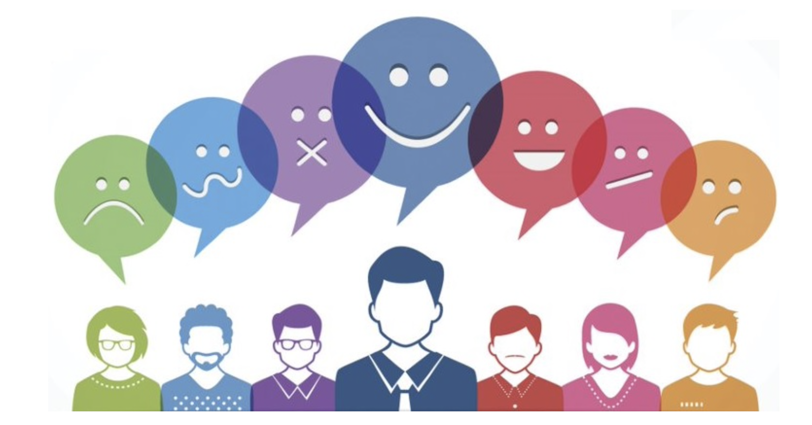
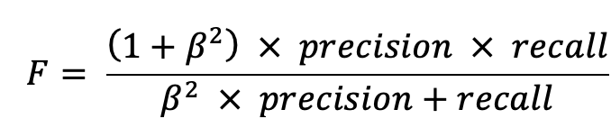
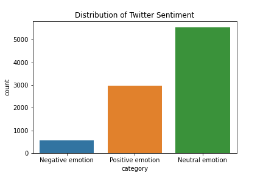
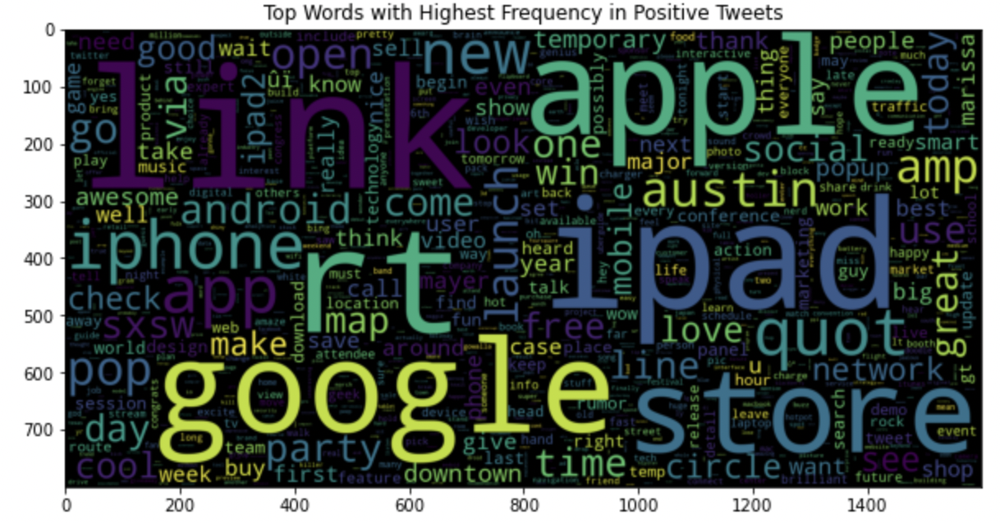

# Twitter Sentiment Analysis
Author: Volha Puzikava
***

## Disclaimer
The described analyses fulfill educational purposes only. The hypothetical business case and the results of sentiment analysis should not be perceived as real customers' attitudes and served as a push for remedial actions, as they have not been approved by any professional media organization.
***

## Overview
Sentiment analysis, also referred to as opinion mining, is an approach that identifies the emotional tone behind a body of text and categorizes pieces of writing as positive, negative or neutral. 

Sentiment analysis is a popular way for organizations to determine and classify opinions about a product, service, or idea. With the help of sentiment analysis companies get a better understanding of how customers feel about their brand, gain insights that help to improve their products and services, make business more responsive to customer feedback, react quickly to negative sentiment and turn it around, monitor brand’s reputation in real-time, and keep customers happy by always putting their feelings first.

This project tends to analyze Twitter sentiment about Apple and Google products in order to detect negative mentions and take remedial actions before they escalate. 
***

## Business Problem
Tweeter Home Enterteinment Group asked to analyze Twitter sentiment about Apple and Google products in order to help businesses monitor their brands and understand customers needs. The main purpose of the analysis was to build an NLP model that could rate the sentiment of a Tweet based on its content and detect angry customers or negative mentions, so the company could take remedial actions fast before the negativity escalates.
***

## Data Understanding
The data for the analysis was taken from CrowdFlower via data.world links. Human raters rated the sentiment in over 9,000 Tweets as positive, negative, or neutral.

The data represented an imbalanced multiclass classification problem. Since the company wanted to concentrate on the negative Tweets in order to take remedial actions fast, both false positives and false negatives were of a cost in the analysis. In the case of a false positive, a positive Tweet would be identified as negative and the company would have to spend resources and time to analyze it. However, in the case of a false negative, the model would identify a negative Tweet as positive, and the company would miss the sentiment of interest and let negativity escalate. Since the class proportion in the analyzed dataset was skewed and both false negatives and false positives were balanced in importance, F-measure, or the harmonic mean of the precision and recall values, was chosen as an evaluation metric. However, because in this particular situation false negatives were more important to minimize, while false positives were still significant (for the company it would be better not to miss any negative tweets than spend time on analyzing positives that were identifies as negatives), F-measure with more attention on recall was preferred.

The solution for this problem was found by using the Fbeta-measure. The Fbeta-measure is an abstraction of the F-measure where the balance of precision and recall in the calculation of the harmonic mean is controlled by a coefficient called beta:

The β parameter is a strictly positive value that is used to describe the relative importance of recall to precision. A larger β value puts a higher emphasis on recall, while a smaller value puts a higher emphasis on precision. Three common values for the beta parameter are as follows:

* F0.5-Measure (beta=0.5): More weight on precision, less weight on recall.
* F1-Measure (beta=1.0): Balance the weight on precision and recall.
* F2-Measure (beta=2.0): Less weight on precision, more weight on recall

In our scenario, F2-measure of negative tweets was used as an evaluation metric.
***

## Data Preparation and Exploration
The data was uploaded and analyzed. Since the column containing product information the tweet was directed at, had about 64% of null values, it was excluded from the analysis. The columns with the text review and emotions were renamed to 'text' and 'category' respectively. The categories 'No emotion toward brand or product' and 'I can't tell' were treated as neutral emotions. The distribution of sentiments were plotted.

According to the plot, the majority of the Tweets (around 61%) were rated as neutral. 33% of Tweets in the dataset belonged to positive class, while only 6% were rated as negative. Mapping was used to transform categories of sentiments into numerical values, and a new column 'label' was created.

A train-test split was performed. The prediction target for the analysis was the column 'label', so the data was separated into a train set and test set accordingly. 

The first step of data cleaning in training set was standardizing case. The typical way to standardize case was to make everything lowercase. After making the case consistent, hashtags and @mentions were removed from the text. The text was then converted from a single long string into a set of tokens by using RegexpTokenizer. Stopwords were removed as they didn't contain useful information. The final step in the cleaning process was lemmatizing, that used part-of-speech tagging to determine how to transform a word.

Once the data was cleaned up (case standardized and tokenized), some exploratory data analysis was performed. Frequency distribution of top 10 tokens for each category was visualized with the help of a tool from NLTK called FreqDist. It turned out that top 5 words were the same for neutral and positive sentiments. Better visualization of the words with the highest frequency within each category was achieved by using a word cloud, or tag cloud. 

 

To get the tokens out of the text, the TF-IDF algorithm ('Term Frequency-Inverse Document Frequency') was used. It didn't only count the term frequency within each document, but also included how rare the term was. Since the goal of the analysis was to distinguish the content of Tweets from others in corpus, TF-IDF was the most appropriate vectorizer.

Since the data was imbalanced, SMOTE (the Synthetic Minority Oversampling Technique) was used in order to improve the models' performance on the minority class. The technique oversampled negative and positive categories to have the same number of examples as the category with neutral sentiments.

Before building the models, the preprocessing steps as stated above were applied to the test data, so the models performances could be evaluated on unseen data.
***
