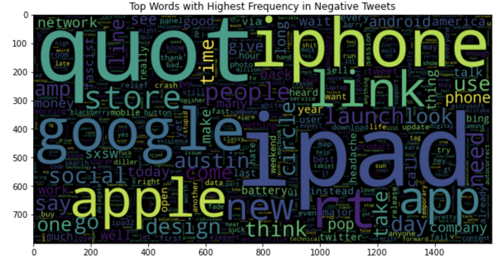
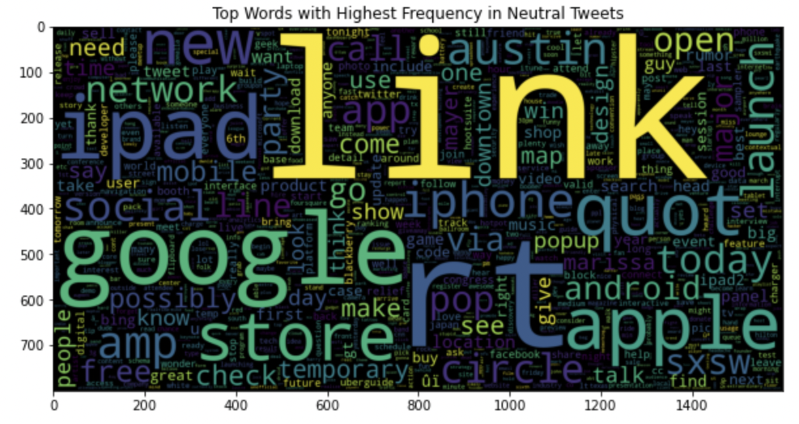

# Twitter Sentiment Analysis
Author: Volha Puzikava
***

## Disclaimer
The described analyses fulfill educational purposes only. The hypothetical business case and the results of sentiment analysis should not be perceived as real customers' attitudes and served as a push for remedial actions, as they have not been approved by any professional media organization.
***

## Overview
Sentiment analysis, also referred to as opinion mining, is an approach that identifies the emotional tone behind a body of text and categorizes pieces of writing as positive, negative or neutral. 

Sentiment analysis is a popular way for organizations to determine and classify opinions about a product, service, or idea. With the help of sentiment analysis companies get a better understanding of how customers feel about their brand, gain insights that help to improve their products and services, make business more responsive to customer feedback, react quickly to negative sentiment and turn it around, monitor brand’s reputation in real-time, and keep customers happy by always putting their feelings first.

This project tends to analyze Twitter sentiment about Apple and Google products in order to better understand how people feel about them. 
***

## Business Problem
Tweeter Home Enterteinment Group asked to analyze Twitter sentiment about Apple and Google products in order to help businesses monitor their brands and understand customers needs. The main purpose of the analysis was to build an NLP model that could rate the sentiment of a Tweet based on its content and give insights to the companies how people feel about their products.
***

## Data Understanding
## Data Understanding
The data for the analysis was taken from CrowdFlower via data.world links. Human raters rated the sentiment in over 9,000 Tweets as positive, negative, or neutral.

The data represented an imbalanced multiclass classification problem. Since the company wanted to learn how customers felt about certain products, both false positives and false negatives were of a cost in the analysis. In the case of a false positive, a positive Tweet would be identified as negative and the company would have to spend resources and time to analyze it. However, in the case of a false negative, the model would identify a negative Tweet as positive, and the company would miss the sentiment of interest and let negativity escalate. Since the class proportion in the analyzed dataset was skewed and both false negatives and false positives were balanced in importance, Fbeta-measure, or the harmonic mean of the precision and recall values, was chosen as an evaluation metric.

The Fbeta-measure is a measure where the balance of precision and recall in the calculation of the harmonic mean is controlled by a coefficient called beta: 

The β parameter is a strictly positive value that is used to describe the relative importance of recall to precision. A larger β value puts a higher emphasis on recall, while a smaller value puts a higher emphasis on precision. Three common values for the beta parameter are as follows:

* F0.5-Measure (beta=0.5): More weight on precision, less weight on recall.
* F1-Measure (beta=1.0): Balance the weight on precision and recall.
* F2-Measure (beta=2.0): Less weight on precision, more weight on recall

In our scenario, F1-measure was used. Since the data was imbalanced and the interest was in learning the feelings about the products, all classes were equally important. For evaluation, macro-F1 score was chosen. It was computed by taking the arithmetic mean of all the per-class F1 scores.
***

## Part I
## Data Preparation and Exploration
The data was uploaded and analyzed. Since the column containing product information the tweet was directed at, had about 64% of null values, it was excluded from the analysis. The columns with the text review and emotions were renamed to 'text' and 'category' respectively. The categories 'No emotion toward brand or product' and 'I can't tell' were treated as neutral emotions. The distribution of sentiments were plotted.

According to the plot, the majority of the Tweets (around 61%) were rated as neutral. 33% of Tweets in the dataset belonged to positive class, while only 6% were rated as negative. Mapping was used to transform categories of sentiments into numerical values, and a new column 'label' was created.

A train-test split was performed. The prediction target for the analysis was the column 'label', so the data was separated into a train set and test set accordingly. 

The first step of data cleaning in training set was standardizing case. The typical way to standardize case was to make everything lowercase. After making the case consistent, hashtags and @mentions were removed from the text. The text was then converted from a single long string into a set of tokens by using RegexpTokenizer. Stopwords were removed as they didn't contain useful information. The final step in the cleaning process was lemmatizing, that used part-of-speech tagging to determine how to transform a word.

Once the data was cleaned up (case standardized and tokenized), some exploratory data analysis was performed. Frequency distribution of top 10 tokens for each category was visualized with the help of a tool from NLTK called FreqDist. It turned out that top 5 words were the same for neutral and positive sentiments. Better visualization of the words with the highest frequency within each category was achieved by using a word cloud, or tag cloud. 

  
  

To get the tokens out of the text, the TF-IDF algorithm ('Term Frequency-Inverse Document Frequency') was used. It didn't only count the term frequency within each document, but also included how rare the term was. Since the goal of the analysis was to distinguish the content of Tweets from others in corpus, TF-IDF was the most appropriate vectorizer.

Since the data was imbalanced, SMOTE (the Synthetic Minority Oversampling Technique) was used in order to improve the models' performance on the minority class. The technique oversampled negative and positive categories to have the same number of examples as the category with neutral sentiments.

Before building the models, the preprocessing steps as stated above were applied to the test data, so the models performances could be evaluated on unseen data.
***

## Data Modeling
### Multinomial Naive Bayes Model
Multinomial Naive Bayes is one of the most popular supervised learning classifications that is used for the analysis of the categorical text data. The algorithm is based on the Bayes theorem and calculates the probability of each tag for a given sample and then gives the tag with the highest probability as output.

According to the confusion matrix false negative values were equal to 70, while false positives values - to 230.  Since the data was imbalanced and the company aimed to learn how people feel about the products, macro F1 score was calculated.

Thus, the MultinomialNB model’s ability to both capture Tweets and be accurate with those Tweets was only 52%. The model also correctly identified Tweets as positive or negative about 59% of the time.

### Logistic Regression Model
The LogisticRegression class was configured for multinomial logistic regression by setting the “multi_class” argument to “multinomial” and the “solver” argument to a solver that supported multinomial logistic regression - “lbfgs“.

The number of FNs constituted 78, while the number of FP - 140. The Logistic Regression model’s ability to both capture precision and recall got a little higher (57)%. The model also correctly identified a Tweet about 64% of the time. Thus, Logistic Regression performed a little better that MultinomialNB.

#### Tuned Logistic Regression Model ('C': 0, 'max_iter': 100, 'penalty': 'none')
The Logistic Regression model was tuned to check if it could perform any better. It turned out, that the tuned model with the parameters 'C' equal to 0, 'max_iter' equal to 100, and 'penalty' equal to 'none', performed worse than the baseline model. It had 97 FNs and 60 FPs. Also, the abiliy to capture both precision and recall constituted only 55%, while the accuracy of the model decreased to 63%.

#### K-Nearest Neighbors Model
KNN is a super simple algorithm, which assumes that similar things are in close proximity of each other. So if a datapoint is near to another datapoint, it assumes that they both belong to similar classes. 

The results of the KNN model were not great. It had 80 FNs and 207 FPs. The F score constituted only 48%, meaning that the model could capture precision and recall only 48% of the time. The accuracy of the model was only 56%. The model was tuned to check if it could perform better.

#### Tuned K-Nearest Neighbors Model ('metric': 'manhattan', 'n_neighbors': 5, 'weights': 'distance')
The F score of the Tuned KNN model constituted 50%. The number of FNs increased to 110 and FPs decreased to 49. The accuracy of the model was equal to 63%.

#### Support Vector Machine Model
The multiclassification problem was broken down into multiple binary classification problems using 'one-to-one' approach. The idea was to map data points to high dimensional space to gain mutual linear separation between every two classes, or in other words to get a binary classifier per each pair of classes.

Although the accuracy score of the SVM model was the highest (68%), the F score was equal to 55%. The number of FNs constituted 116 and FPs - only 20. The model was tuned to check if it could perform any better. 

#### Tuned Support Vector Machine Model ('C': 10, 'gamma': 3)
The tuned SVM model performed even worse. Although the accuracy was 65%, the F score decreased to 48%. The number of FNs increased to 124, while the number of FPs was the lowest among all the models (15).

#### Random Forest Model
A random forest is an ensemble classifier that estimates based on the combination of different decision trees. Effectively, it fits a number of decision tree classifiers on various subsamples of the dataset. Also, each tree in the forest is built on a random best subset of features. Finally, the act of enabling these trees gives the best subset of features among all the random subsets of features. 

The F score of the Random Forest model was equal to 55%. The accuracy of the model constituted 67%. The number of FNs was also high (116), while FPs were only 17 for the negative class. The model was tuned to check if it could perform any better.

#### Tuned Random Forest Model ('criterion': 'entropy', 'max_features': 'log2', 'n_estimators': 150)
The F score of the tuned model was 55% as well, while the accuracy constituted 68%. The number of FNs was equal to 115, while the number of FPs - to 16 only.
***

### Model Evaluation
The graph with the F scores of different models was plotted. Since it was more important to correctly label an instance as a negative class, the model that produced a better F score on the negative class was selected. It was found out that the best F score belonged to the Logistic Regression model. The classification report of the mentioned model and the F score for the negative class were generated again.

Based on the report, it was determined that the model correctly identifies a Tweet about 64% of the time. The F score value for the model is 57%, meaning that the model's balanced ability to both capture Tweets (recall) and be accurate with those Tweets (precision) is only 57%. The results were not perfect and neural networks were tried out.