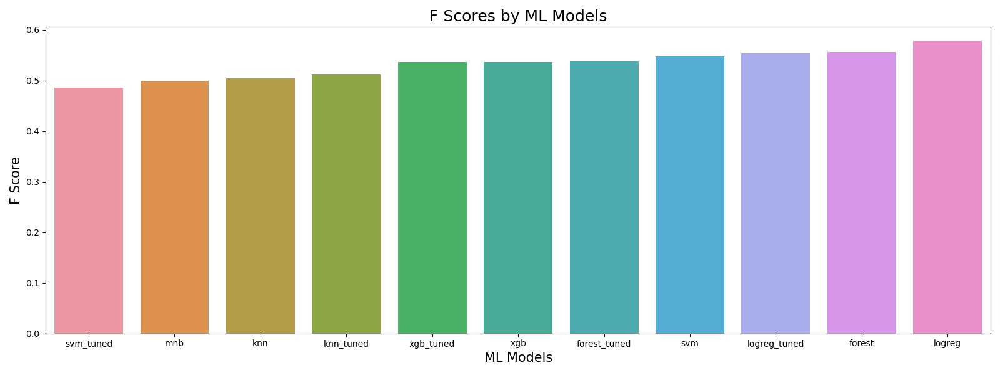

# Twitter Sentiment Analysis
Author: Volha Puzikava
***

## Disclaimer
The described analyses fulfill educational purposes only. The hypothetical business case and the results of sentiment analysis should not be perceived as real customers' attitudes and served as a push for remedial actions, as they have not been approved by any professional media organization.
***

## Overview
Sentiment analysis, also referred to as opinion mining, is an approach that identifies the emotional tone behind a body of text and categorizes pieces of writing as positive, negative or neutral. 

Sentiment analysis is a popular way for organizations to determine and classify opinions about a product, service, or idea. With the help of sentiment analysis companies get a better understanding of how customers feel about their brand, gain insights that help to improve their products and services, make business more responsive to customer feedback, react quickly to negative sentiment and turn it around, monitor brand’s reputation in real-time, and keep customers happy by always putting their feelings first.

This project tends to analyze Twitter sentiment about Apple and Google products in order to better understand how people feel about them. 
***

## Business Problem
Tweeter Home Enterteinment Group asked to analyze Twitter sentiment about Apple and Google products in order to help businesses monitor their brands and understand customers needs. The main purpose of the analysis was to build an NLP model that could rate the sentiment of a Tweet based on its content and give insights to the companies how people feel about their products.
***

## Data Understanding
The data for the analysis was taken from CrowdFlower via data.world links. Human raters rated the sentiment in over 9,000 Tweets as positive, negative, or neutral.

The data represented an imbalanced multiclass classification problem. Since the company wanted to learn how customers felt about certain products, both false positives and false negatives were of a cost in the analysis. In the case of a false positive, a positive Tweet would be identified as negative and the company would have to spend resources and time to analyze it. However, in the case of a false negative, the model would identify a negative Tweet as positive, and the company would miss the sentiment of interest and let negativity escalate. Since the class proportion in the analyzed dataset was skewed and both false negatives and false positives were balanced in importance, Fbeta-measure, or the harmonic mean of the precision and recall values, was chosen as an evaluation metric.

The Fbeta-measure is a measure where the balance of precision and recall in the calculation of the harmonic mean is controlled by a coefficient called beta: 

The β parameter is a strictly positive value that is used to describe the relative importance of recall to precision. A larger β value puts a higher emphasis on recall, while a smaller value puts a higher emphasis on precision. Three common values for the beta parameter are as follows:

* F0.5-Measure (beta=0.5): More weight on precision, less weight on recall.
* F1-Measure (beta=1.0): Balance the weight on precision and recall.
* F2-Measure (beta=2.0): Less weight on precision, more weight on recall

In our scenario, F1-measure was used. Since the data was imbalanced and the interest was in learning the feelings about the products, all classes were equally important. For evaluation, macro-F1 score was chosen. It was computed by taking the arithmetic mean of all the per-class F1 scores.
***

## Part I: Supervised ML Algorithms
## Data Preparation and Exploration
The data was uploaded and analyzed. Since the column containing product information the tweet was directed at, had about 64% of null values, it was excluded from the analysis. The columns with the text review and emotions were renamed to `'text'` and `'category'` respectively. The categories `'No emotion toward brand or product'` and `'I can't tell'` were treated as neutral emotions. The distribution of sentiments were plotted.

According to the plot, the majority of the Tweets (around 61%) were rated as neutral. 33% of Tweets in the dataset belonged to positive class, while only 6% were rated as negative. Mapping was used to transform categories of sentiments into numerical values, and a new column `'label'` was created.

A train-test split was performed. The prediction target for the analysis was the column `'label'`, so the data was separated into a train set and test set accordingly. 

The first step of data cleaning in training set was standardizing case. The typical way to standardize case was to make everything lowercase. After making the case consistent, hashtags and @mentions were removed from the text. The text was then converted from a single long string into a set of tokens by using `RegexpTokenizer`. Stopwords were not removed as they contained useful information for the sentiment analysis (after stopwords removal, a negative review can become positive). The final step in the cleaning process was lemmatizing, that used part-of-speech tagging to determine how to transform a word.

Once the data was cleaned up (case standardized and tokenized), some exploratory data analysis was performed. Frequency distribution of top 10 tokens for each category was visualized with the help of a tool from NLTK called `FreqDist`. Better visualization of the words with the highest frequency within each category was achieved by using a word cloud, or tag cloud. 

  
  

To get the tokens out of the text, the TF-IDF algorithm ('Term Frequency-Inverse Document Frequency') was used. It didn't only count the term frequency within each document, but also included how rare the term was. Since the goal of the analysis was to distinguish the content of Tweets from others in corpus, TF-IDF was the most appropriate vectorizer.

Since the data was imbalanced, `SMOTE` (the Synthetic Minority Oversampling Technique) was used in order to improve the models' performance on the minority class. The technique oversampled negative and positive categories to have the same number of examples as the category with neutral sentiments.

Before building the models, the preprocessing steps as stated above were applied to the test data, so the models performances could be evaluated on unseen data.
***

## Data Modeling
### Multinomial Naive Bayes Model
Multinomial Naive Bayes is one of the most popular supervised learning classifications that is used for the analysis of the categorical text data. The algorithm is based on the Bayes theorem and calculates the probability of each tag for a given sample and then gives the tag with the highest probability as output.

Since the data was imbalanced and the company aimed to learn how people felt about the products, macro F1 score was calculated.

The MultinomialNB model’s ability to both capture Tweets and be accurate with those Tweets was only 50%. The model also correctly identified Tweets as positive or negative about 57% of the time.

### Logistic Regression Model
The Logistic Regression class was configured for multinomial logistic regression by setting the `'multi_class'` argument to `'multinomial'` and the `'solver'` argument to a solver that supported multinomial logistic regression - `'lbfgs'`.

The Logistic Regression model’s ability to both capture precision and recall got higher (58)%. The model also correctly identified a Tweet about 65% of the time. Thus, Logistic Regression performed a little better that MultinomialNB.

### Tuned Logistic Regression Model (`'C': 0, 'max_iter': 100, 'penalty': 'none'`)
The Logistic Regression model was tuned to check if it could perform any better. The Tuned Logistic Regression model performed worse than the baseline model. The abiliy to capture both precision and recall constituted only 55%, while the accuracy of the model decreased to 64%.

### K-Nearest Neighbors Model
KNN is a super simple algorithm, which assumes that similar things are in close proximity of each other. So if a datapoint is near to another datapoint, it assumes that they both belong to similar classes. 

The results of the KNN model were not great. The F score constituted only 51%, meaning that the model could capture precision and recall only 51% of the time. The accuracy of the model was only 58%. The model was tuned to check if it could perform better.

### Tuned K-Nearest Neighbors Model (`'metric': 'manhattan', 'n_neighbors': 5, 'weights': 'distance'`)
The F score of the Tuned KNN model constituted 51%. The accuracy of the model was equal to 64%.

### Support Vector Machine Model
The multiclassification problem was broken down into multiple binary classification problems using `'one-to-one'` approach in SVC algorithm. The idea was to map data points to high dimensional space to gain mutual linear separation between every two classes, or in other words a binary classifier per each pair of classes.

Although the accuracy score of the SVM model was the highest (68%), the F score was equal to 55%. The model was tuned to check if it could perform any better. 

### Tuned Support Vector Machine Model (`'C': 10, 'gamma': 3`)
The tuned SVM model performed even worse. Although the accuracy was 65%, the F score decreased to 49%.

### Random Forest Model
A random forest is an ensemble classifier that estimates based on the combination of different decision trees. Effectively, it fits a number of decision tree classifiers on various subsamples of the dataset. Also, each tree in the forest is built on a random best subset of features. Finally, the act of enabling these trees gives the best subset of features among all the random subsets of features. 

The F score of the Random Forest model was equal to 56%. The accuracy of the model constituted 68%. The model was tuned to check if it could perform any better.

### Tuned Random Forest Model (`'criterion': 'entropy', 'max_features': 'log2', 'n_estimators': 150`)
The F score of the tuned model was 54% as well, while the accuracy constituted 67%.

### XGBoost Model
XGBoost is a decision-tree-based ensemble Machine Learning algorithm that uses a gradient boosting framework. When it comes to small-to-medium structured/tabular data, decision tree based algorithms are considered to be best-in-class.

The XGBoost model didn't perform very well. The accuracy of the model was 67%, while the f1 score constituted only 54%. The model was tuned to check if it performed any better.

### Tuned XGBoost Model (`'learning_rate': 0.2, 'max_depth': 6, 'min_child_weight': 1, 'n_estimators': 100, 'subsample': 0.7`)
The values of accuracy and f1 score of the tuned XGBoost Model stayed the same and were equal to 68% and 54% respectively.
***

### Model Evaluation
The graph with the F scores of different models was plotted. Since the company aimed to learn how people felt about the products, the model that produced a better F score was selected. It was found out that the best F score belonged to the Logistic Regression model. The classification report of the mentioned model and the F score were generated again.

Based on the report, it was determined that the model correctly identifies a Tweet about 65% of the time. The F score value for the model is 58%, meaning that the model's balanced ability to both capture Tweets (recall) and be accurate with those Tweets (precision) is only 57%. The results were not perfect and neural networks were tried out.
***

## Part II: Neural Networks
Among all the built ML models Logistic Regression showed the best results. It had an F1 score of 57%. F-measure was chosen due to the dataset imbalance and the importance of both false negatives and false positives. The result of the F score was not ideal. It indicated that the model's performance was a little better than average, and neural networks were tried out to improve the accuracy of the predictions.

Neural networks have been used extensively in natural language processing and they provide powerful new tools for modeling language. They are applied to many language problems: unsupervised learning of word representations, supervised text classification, language modeling, etc. They are well suited for learning the complex underlying structure of a sentence and semantic proximity of various words. Neural networks are much more flexible than other ML models, as they allow to easily experiment with different structures, adding and removing layers as needed. Neural networks are also easy to train as new data comes in.
***

## Data Preparation and Exploration
Before building neural networks, several preprocessing steps were performed. The data with the renamed columns (columns with the text review and emotions renamed to `'text'` and `'category'`) and regrouped sentiments (`'No emotion toward brand or product'` and `'I can't tell'` treated as neutral emotions) was downloaded. The data was split into training and test sets. A validation set was set aside, it was further used during hyperparameter tuning, while the test set was used to determine an unbiased performance of the model.

The first step was to transform the textual data into numerical representation. For this purpose `Tokenizer()` was used that transformed the `'text'` column into word vectors, while preserving word order. The 3,000 most common words were kept, one-hot encoding was used to reformat the text into a matrix of vectors, and training, validate and test sets were transformed.

The next step of the preprocessing was to convert the descriptive categories into integers product, and then retransform them into a matrix of binary flags, one for each of the various product labels. 

This step is similar to the work with dummy variables. Each of the various product categories becomes its own column, and each observation becomes a row. In turn, each of these observation rows will have a 1 in the column associated with its label, and all other entries for the row will be zero.

Neural networks are one popular method for classifying imbalanced data. However, data imbalance often negatively affects neural networks. This problem is exacerbated when data are highly imbalanced. Existing neural network approaches for handling this problem heavily rely on rebalancing or reweighting known data. In this particular case `SMOTE` was applied to training set to improve model's performance on the minority class.
***

## Data Modeling
### Baseline Model
A fully connected (Dense) layer network was build:
* 2 hidden layers with 50 units in the first and 25 in the second layer, both with `'relu'` activation functions, were used
* a `'softmax'` activation function was used for the output layer with 3 units in it (since the problem was multiclass, that classified the text into 3 categories)

The model was then compiled with:
* a stochastic gradient descent optimizer
* `'categorical_crossentropy'` as the loss function
* a focus on `'accuracy'` and `'macro-f1 score'`

The model was finally trained for 250 epochs in mini-batches of 256 samples. The argument `'validation_data'` was included to ensure the track of validation loss was kept.

The model was evaluated on training and test data. The loss versus the number of epochs was plotted. The training and validation accuracy as well as F1 scores to the number of epochs were then compared.

There was an interesting pattern: although the training accuracy and f1 score kept increasing when going through more epochs, and the training loss kept decreasing, the validation accuracy, f1 score and loss didn't necessarily do the same. After a certain point, validation accuracy kept swinging, which meant that the model was probably overfitting the training data when training for many epochs past a cetrain dropoff point.

Overfitting neural networks is something that should be avoided at all costs. However, it's not possible to know in advance how many epochs you need to train the model on, and running the model multiple times with varying number of epochs maybe helpfu, but it is a time-consuming process. An early stopping point when training the model was specified to tackle the problem.

### Model with Early Stopping
The model had the same architecture as above. A list `'early_stopping'` was defined. It monitored `'val_loss'` and continued training for 10 epochs before stopping. The best model while monitoring `'val_loss'` was saved.

The model didn't train for all 250 epochs. The training time was reduced and only 133 epochs were trained on. However, the results didn't differ much from the baseline model. Regularization techniques were tried out to further improve the model performance.

### Model with L2 Regularization
The model architecture was the same, however, L2 regularization to both the hidden layers with 0.005 as the `lambda_coeff` was added. The `lambda_coeff` parameter determines the strength of the regularization you wish to perform.

The accuracy and F1 scores for baseline and L2 models were compared. The results of L2 regularization were quite disappointing: they were not getting any better. L1 regularization was tried out if it could bring any improvement.

### Model with L1 Regularization
The architecture of the model remained the same. L1 regularization to both the hidden layers with 0.005 as the `lambda_coeff` was added.

The results of the F1 score and accuracy became even worse. The training and validation accuracy and F1 scores for the L1 model were plotted. Although the training and validation accuracy and F1 scores didn't diverge as much as before, the results were very disapponting. Dropout regularization was experimented with to see if it could offer any advantages.

### Model with Dropout Regularization
Dropout was applied to layers. This involved setting a certain proportion of units in each layer to zero.
* A dropout rate of 30% was applied to the input layer
* A first hidden layer with 50 units and `'relu'` activation was added
* A dropout rate of 30% was applied to the first hidden layer
* A second hidden layer with 25 units and `'relu'` activation was added
* A dropout rate of 30% was applied to the second hidden layer

The results didn't get better and were quite disapponting.

Among the various neural network models built for the task at hand, the Baseline model demonstrated the best performance, boasting the F1 score of 65% and an accuracy of 65%. This model, with its minimal complexity and straightforward architecture, emerged as the frontrunner among its counterparts.
***

### Model Evaluation
Based on the F1 scores of the built neural network models, the Baseline Neural Network showed the best results. While the F1 score of 65% is not considered a perfect result, it undoubtedly standed out when compared to the outcomes achieved by the regular machine learning algorithms. The 65% F1 score represented a significant improvement over the Logistic Regression model with the F1 score of 57%, indicating substantial progress in the task at hand.

The leap from the Logistic Regression to a 65% F1 score signified a substantial advancement in the model's balanced ability to both capture Tweets (recall) and be accurate with those Tweets (precision), while correctly identifing a Tweet about 65% of the time.

In conclusion, while the F1 score of 65% may fall short of perfection, it stands out as a remarkable achievement when compared to the results obtained from traditional machine learning algorithms. This significant improvement signifies the model's ability to overcome previous limitations and highlights the promising prospects for future advancements in the field.
***

### Conclusions
In conclusion, the Baseline Neural Network model emerged as the top-performing model, demonstrating superior results compared to other algorithms. However, it is important to note that even though it showcased a better F1 score, it was not perfect. One possible reason for the model's imperfection could be the limited size of the dataset.

Neural networks, with their ability to learn complex patterns and relationships, often require large amounts of data to generalize effectively. With a small dataset, the neural network may not have had enough diverse examples to fully capture the underlying patterns and variations present in the target problem.

Despite this limitation, the neural network's ability to outperform other algorithms highlights its potential and robustness. Its superior performance suggests that with a larger and more diverse dataset, the model could potentially achieve even better results.

It is worth emphasizing the importance of data in training accurate and reliable machine learning models. While the neural network showed the best F1 score among the models built, it is crucial to consider the quality and quantity of data available. Collecting and curating a larger dataset could potentially enhance the model's performance and address its imperfections.

Overall, while the Baseline Neural Network model demonstrated the best F1 score, the presence of imperfection suggests that further research and development are necessary to overcome limitations associated with dataset size. More data should be collected for achieving higher levels of F1 score and accuracy.
***